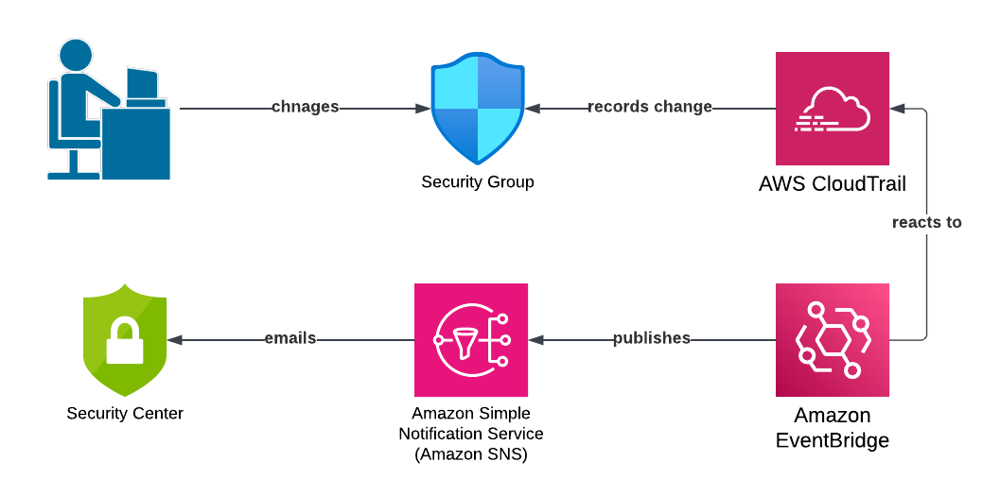

# cloudtrial-eventbridge

This Terraform script sets up EventBridge to react to a change of a security group.  This is the simpliest and fastest way to alert based on a Cloudtrail entry.  The file sample_event_message.json shows an expected payload for a message from SNS after an inbound security group rule CIDR block was changed.  Note that it shows the rule after the change and not before.

To run this Terraform, simply enter your email address for "sns_email" in terraform.tfvars and apply.

